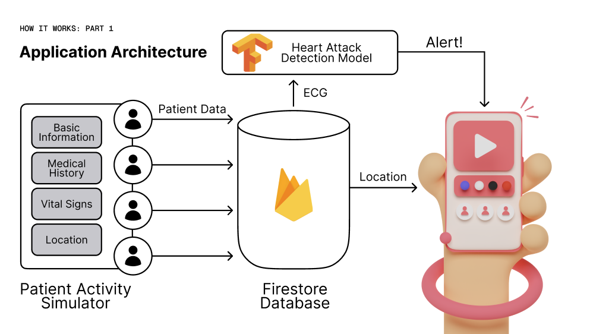
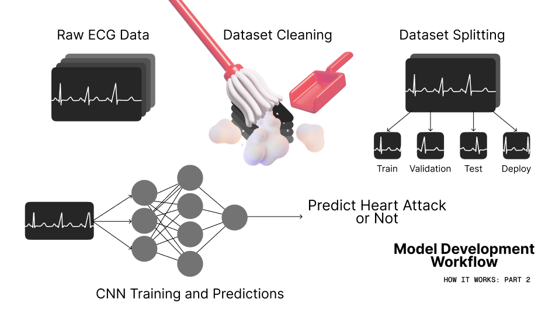

# Vita (nwHacks 2024 Project) :anatomical_heart:

Vita is a mobile application that facilitates a patient monitoring system for residents
in senior homes. The aim of this project was to help address the shortage of healthcare
workers while promoting the safety and health of senior citizens in assisted living.

Want to see more? Check out our [Devpost submission](https://devpost.com/software/vita-paxt8v) or our
[Figma prototype](https://www.figma.com/proto/6BKYWsau3VYHJrj8dGwFgu/NWHACKS-2024?page-id=8%3A3442&type=design&node-id=8-3443&viewport=242%2C219%2C0.32&t=yZ1z12kpzbSm2afK-1&scaling=scale-down&starting-point-node-id=8%3A3443&show-proto-sidebar=1&mode=design).

<p align="center">
    
</p>


## Project Inspiration :bulb:

During the pandemic, nursing homes recorded a high number of deaths. These 40,000 deaths were not a
result of COVID-19, rather they were a result of understaffing in nursing homes.[^1]

Up to 90% of nursing homes are understaffed, and one nurse’s aide may have to take care of up to 15
patients at once when they’re only supposed to have 7 or 8.[^2] 46% of nurses also said they’ve missed
changes in a patient’s condition because of their excessive workload.[^3]

As a result of these unfortunate statistics, we asked ourselves the following question:

> How might we develop a digital solution that helps relieve some of the burden understaffed care
workers go through, essentially helping them take care of their patients?


## Project Implementation :hammer_and_wrench:

<p align="center">
    
</p>

Vita is composed of four major components:

1. Patient Simulator
2. Firebase Backend
3. Heart Attack Detection Model
4. Mobile Application


### Patient Simulator ([`simulator/`](./simulator/)) :health_worker:

The patient simulator was written using Python and concurrent programming using
the [asyncio](https://docs.python.org/3/library/asyncio.html) library.

Each simulated patient executes as its own routine in parallel with other. This
routine does the following:

1. Grabs the latest ECG and location data from the patient
2. Use the machine learning model to check if the patient is experiencing a heart attack or not
    - If the patient is experiencing a heart attack, the mobile app is notified
3. Push the latest information to the firestore database

To simulate a heart attack, the simulator also supports I/O by writing a custom signal
handler for keyboard interrupts. The normal ECG for a patient is swapped for an ECG
that indicates that myocardial infarction is occurring, which the model will pick up.

This process repeats indefinitely.


### Firebase Backend :fire:

The main purpose of the firebase backend was to facilitate the data transfer between the simulator
and the mobile app. In addition to acting as our database, firestore was selected particularly
because of its realtime transmission capabilities since our application relied on such behavior.

We used a single collection called `patients` storing a document for each patient. Each document
had the following structure (with some example data):

```json
{
    "age": 55,
    "birthdate": "1969-01-15",
    "emergency_contact": {
        "name": "Jane Doe",
        "phone": "555-555-5555"
    },
    "medical_history": "Type I Diabetes",
    "name": "John Doe",
    "room": "6",
    "sensor_data": {
        "ecg": [
            0.193,
            0.198,
            0.244,
            // 10 seconds of data stored sampled at 100Hz
        ],
        "is_having_heart_attack": false,
        "location": "HEARTH ROOM",
    }
}
```


### Heart Attack Detection Model ([`machine_learning/`](./machine_learning/ECG_Model.ipynb)) :signal_strength:

<p align="center">
    
</p>

The heart attack detection model uses a convolutional neural network and classifies the last 10 seconds of
a patients ECG to indicate that they are experiencing a heart attack.

We used the PTB-XL dataset to train the model.[^4] We started by processing the dataset with the following
steps:

1. Filtered for documents labeled as "Normal ECG" and "Myocardial Infarction" (heart attack) sampled at 100Hz
2. Computed a distribution of peak-to-peak voltages for each ECG label and kept samples within 1 standard deviation
3. The dataset was split into four: train, validation, test, and deployment

We then trained a convolutional neural network to classify each ECG in the dataset. The following is the
model architecture used (from `model.summary()` in tensorflow):

```
_________________________________________________________________
 Layer (type)                Output Shape              Param #   
=================================================================
 conv1d_25 (Conv1D)          (None, 64, 993)           576       
                                                                 
 batch_normalization_9 (Bat  (None, 64, 993)           3972      
 chNormalization)                                                
                                                                 
 leaky_re_lu_25 (LeakyReLU)  (None, 64, 993)           0         
                                                                 
 max_pooling1d_25 (MaxPooli  (None, 32, 993)           0         
 ng1D)                                                           
                                                                 
 conv1d_26 (Conv1D)          (None, 32, 988)           6176      
                                                                 
 leaky_re_lu_26 (LeakyReLU)  (None, 32, 988)           0         
                                                                 
 max_pooling1d_26 (MaxPooli  (None, 16, 988)           0         
 ng1D)                                                           
                                                                 
 conv1d_27 (Conv1D)          (None, 16, 985)           1040      
                                                                 
 leaky_re_lu_27 (LeakyReLU)  (None, 16, 985)           0         
                                                                 
 max_pooling1d_27 (MaxPooli  (None, 8, 985)            0         
 ng1D)                                                           
                                                                 
 conv1d_28 (Conv1D)          (None, 8, 983)            200       
                                                                 
 leaky_re_lu_28 (LeakyReLU)  (None, 8, 983)            0         
                                                                 
 max_pooling1d_28 (MaxPooli  (None, 4, 983)            0         
 ng1D)                                                           
                                                                 
 flatten_9 (Flatten)         (None, 3932)              0         
                                                                 
 dense_18 (Dense)            (None, 1000)              3933000   
                                                                 
 dropout_9 (Dropout)         (None, 1000)              0         
                                                                 
 dense_19 (Dense)            (None, 100)               100100    
                                                                 
 dropout_10 (Dropout)        (None, 100)               0         
                                                                 
 dense_20 (Dense)            (None, 1)                 101       
                                                                 
=================================================================
Total params: 4045165 (15.43 MB)
Trainable params: 4043179 (15.42 MB)
Non-trainable params: 1986 (7.76 KB)
_________________________________________________________________
```

We were able to achieve 93% accuracy on our test dataset as a result of training after just 10 epochs.


### Mobile Application ([`frontend/`](./frontend/)) :iphone:


## References :page_facing_up:


[^1]: [Nursing Homes, the Pandemic, and Caring Enough](https://www.ncbi.nlm.nih.gov/pmc/articles/PMC7359917/)
[^2]: [Elder Abuse: A Comprehensive Overview and Physician-Associated Challenges](https://www.ncbi.nlm.nih.gov/pmc/articles/PMC8110289/)
[^3]: [NursingHomeAbuseGuide.org: Nurse Home Understaffing](https://www.nursinghomeabuseguide.org/neglect/understaffing)
[^4]: [PTB-XL, a large publicly available electrocardiography dataset](https://www.physionet.org/content/ptb-xl/1.0.3/)

